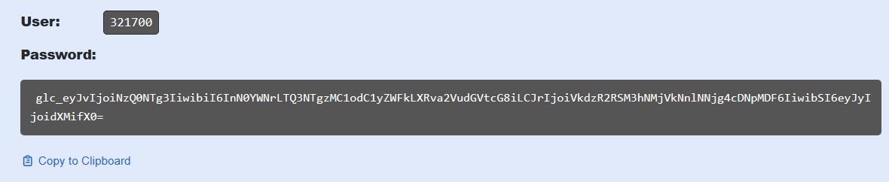

# Atividade 3

### Configurar exportação dos traces.

Vamos configurar o coletor para exportar os traces para o Tempo.

#### Passo 1
Clicar na opção "Send Traces" do Tempo.

Copiar a url do Tempo (sem o https:// e sem /tempo), adicionar :433 no final e colar na tag {Tempo endpoint} do otlp no arquivo collector.yaml.

Clicar em "Generate now" para gerar o token de acesso ao Tempo.

No popup informar o nome do token e clicar em "Create token".

Copiar o token gerado e guardar num arquivo texto.

Copiar o Username e usando um encoder base64, encodar a string "username:token". Para isso você pode utilizar o DevToys uma ferramenta gratuida para Windows que possui várias funções úteis para o dia a dia.

- [Download DevToys](https://devtoys.app/)

Você também pode usar um o site https://www.base64encode.org/ para fazer o encode.

Copiar a string resultante do encoding, substituir a tag {base64 encoded username:password} da configuração do Tempo no arquivo collector.yaml e salvar o arquivo.

Próxima atividade: [Atividade 04](04-atividade.md)

