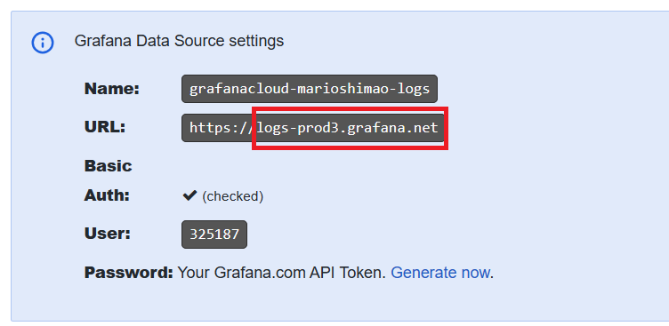

# Atividade 4

### Configurar exportação dos logs.

Vamos configurar o coletor para exportar os traces para o Loki.

#### Passo 1
Clicar na opção "Send Logs" do Loki.

Copiar a url do Loki (sem o https://) e colar na tag {Loki url} do Loki no arquivo collector.yaml.

Clicar em "Generate now" para gerar o token de acesso ao Loki.

No popup informar o nome do token e clicar em "Create token".

Copiar o token gerado e colar na tag {token} da url do Loki no arquivo collector.yaml.

Copiar o user e colar e substituir a tag {user} da configuração do Loki no arquivo collector.yaml e salvar o arquivo.

Próxima atividade: [Atividade 05](05-atividade.md)

