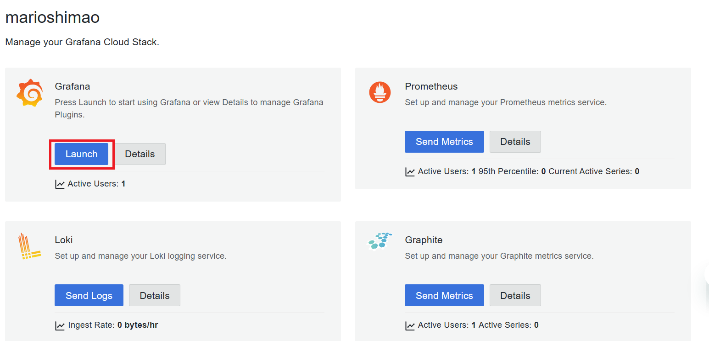

# Atividade 3

### Executar a aplicação e visualizar as métricas no Grafana
Vamos executar uma aplicação Java com a observabilidade configurada, essa aplicação foi implantada numa imagem docker.
Será utilizado o docker compose para subir 2 containeres um com a aplicação Java e outra com o coletor.

#### Passo 1
Abrir um linha de comando e ir até a pasta collector, e executar o comando docker

```bash
docker-compose -f docker-compose-java.yml up -d
```


#### Passo 2
Acessar o Grafana Cloud para visualizar as métricas.

- [https://grafana.com/](https://grafana.com/)

Clicar na opção "Launch" do item Grafana.



#### Passo 3
Clicar em "Home" e no item "Explore".


Selecionar o item "Prometheus" em Outline.


Para parar a execução dos conteineres executar o comando:

```bash
docker-compose -f docker-compose-java.yml down
```
