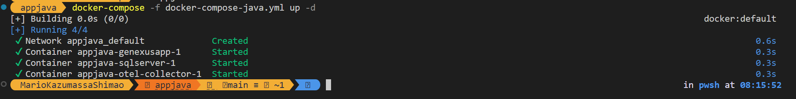
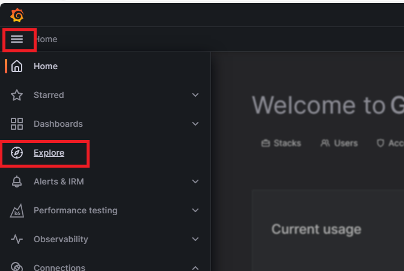

# Atividade 6

### Executar a aplicação e visualizar o log, métricas e trace no Grafana
Vamos executar uma aplicação Java com a observabilidade configurada, essa aplicação foi implantada numa imagem docker.
Será utilizado o docker compose para subir 3 containeres, um com a aplicação Java, outra com o coletor e outra com o banco de dados da aplicação.

#### Passo 1
Abrir um linha de comando e ir até a pasta appjava, e executar o comando docker

```bash
docker-compose -f docker-compose-java.yml up -d
```



**Observação 1** - A primeira execução pode demorar, se as imagens não foram baixadas anteriormente.
**Observação 2** - Quando todos os conteineres estiverem no estado "Started", esperar uns 90 segundos até que o script SQL seja executado para criar a base de dados de exemplo.

#### Passo 2
Executar o request a API de teste para confirmar que a aplicação está respondendo, para isso abrir o arquivo request.http da pasta appjava com o VSCode.
Para executar o request clicar no texto "Send Request".
Esse request pode ser executado no Postman se preferirem.


A resposta deverá trazer um registro como na imagem.


Se o request não funcionar, existe como verificar no Docker Desktop se a aplicação está sendo executada de modo correto.


#### Passo 3
Acessar o Grafana Cloud para visualizar o Trace do chamado da API.

- [https://grafana.com/](https://grafana.com/)

Clicar na opção "Launch" do item Grafana.


#### Passo 4
Clicar em "Home" e no item "Explore".



Selecionar o item "Tempo" em Outline, o nome do item deve ter o seguinte formato **grafanacloud-{nomedaconta}-traces**.


Para visualizar os traces, no item "Query Type", clicar na opção "Search". Depois clicar no botão "Run Query".


Clicar no "Trace ID" para ver os detalhes do trace.


Podemos ver a árvore de chamadas, o tempo que cada item levou para ser executado, ao clicar no item podemos ver os detalhes da execução do item.


#### Passo 4
Agora vamos visualizar o log da aplicação.
Alterar a fonte de dados para o "Loki" em Outline, o nome do item deve ter o seguinte formato **grafanacloud-{nomedaconta}-logs**.


Para visualizar o log, no item "Label Filters", selecionar "AppJava". Depois clicar no botão "Run Query".


Pode ser que nenhum registro seja apresentado, isso se deve ao filtro padrão de tempo, para alterar isso, clicar no ícone do relógio no canto superior, selecionar o item "Last 3 hours", e clicar novamente em "Run Query".


Agora devem ser apresentados os registros de log das últimas 3 horas da aplicação.


#### Passo 5
Agora vamos visualizar as métricas da aplicação.
Alterar a fonte de dados para o "Prometheus" em Outline, o nome do item deve ter o seguinte formato **grafanacloud-{nomedaconta}-prom**. 


Vamos apagar a query e criar outra, clicar no ícone da lixeira a direta.


Agora vamos adicionar um query, clicando em "Add query".


Para selecionar a métrica a ser visualizada, clicar na opção "Metrics browser", e selecionar o item "process_runtime_jvm_cpu_utilization_ratio" 


Selecionar o item "Job" no item "Select label".


Selecionar o item "Handson/AppJava" no item "Select value".


Para visualizar a métrica clicar no botão "Run Query".


Próxima atividade: [Atividade 07](07-atividade.md)

