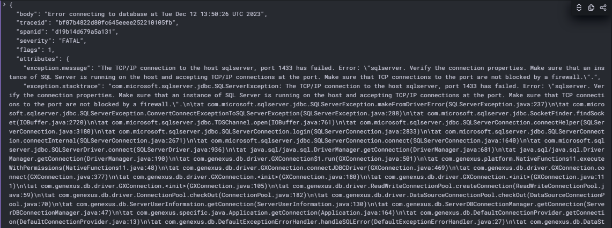

# Atividade 7

### Simular um erro na aplicação e visualizar o log e trace no Grafana
Vamos parar o container do banco de dados e com isso teremos um erro na aplicação Java, e vamos ver como o erro é apresentado no Grafana.


#### Passo 1
Para parar o container do banco de dados vamos usar o Docker Desktop, na opção "Containers", clicar no ícone de Stop da imagem "sqlserver-1"


#### Passo 2
Vamos executar o request e ver o erro. A resposta deverá trazer uma mensagem de erro como na imagem.


#### Passo 3
Agora vamos ver como o erro é apresentado no Grafana.

Selecionar o item "Tempo" em Outline, o nome do item deve ter o seguinte formato **grafanacloud-{nomedaconta}-traces**.


Para visualizar os traces, no item "Query Type", clicar na opção "Search". Depois clicar no botão "Run Query".


Clicar primeiro item da lista, no "Trace ID" para ver os detalhes do trace.


Podemos ver a árvore de chamadas, que houve um erro, ao clicar no item podemos ver os detalhes do erro. Mas para mais detalhes podemos navegar para o log, clicando no ícone log.


Serão apresentados os registros log que estão relacionados com o trace.


E podemos ver o erro com mais detalhes.



#### Passo 4
Agora vamos visualizar os erros no log da aplicação.
Alterar a fonte de dados para o "Loki" em Outline, o nome do item deve ter o seguinte formato **grafanacloud-{nomedaconta}-logs**.


Para visualizar o log, no item "Label Filters", selecionar "AppJava". Informar o texto "ERROR" no campo "Line contains". Depois clicar no botão "Run Query".


Os itens do log com o texto "ERROR" devem ser listados, ao clicar no primeiro item da lista, deve ser apresentado alguns detalhes do erro, com o link para o trace relacionado.


### Passo 5

Para parar a execução dos conteineres, executar o comando abaixo, posicionado na pasta appjava:

```bash
docker-compose -f docker-compose-java.yml down
```


Próxima atividade: [Atividade 08](08-atividade.md)