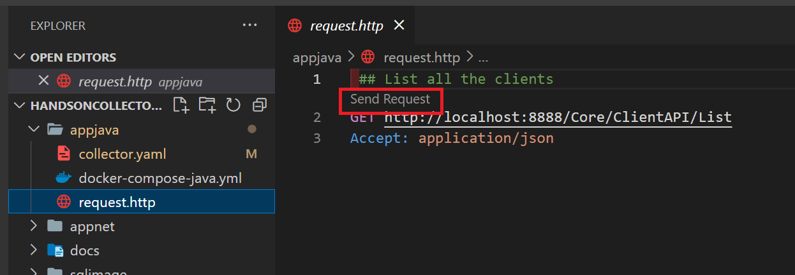

# Atividade 8

### Capturar o log gerado por uma aplicação sem telemetria configurada
Vão existir cenários onde a aplicação é legada, e não será possível configurar o envio dos dados de telemetria para o coletor, mas mesmo assim, se a aplicação gerar um log, podemos coletar as informações do log, ou até mesmo capturar algumas métricas do servidor onde está rodando a aplicação.
Existe também a possibilidade de configurar um proxy para a aplicação, com isso seria possível capturar as informações de trace das requisições feitas para a aplicação.

Nesta atividade, vamos ler o log gerado pela aplicação e enviar para o Grafana.

#### Passo 1
Agora vamos configurar o coletor para ler o arquivo de log e exportar para o Loki.

Editar o arquivo collector.yaml da pasta appnet.

Copiar o endpoint já configurado nas atividades anteriores para esse arquivo.


#### Passo 2
Neste arquivo de configuração, o coletor está configurado para ler o arquivo de log e aplicar uma expressão regular para extrair os dados do log.


#### Passo 3
Outro ponto, é que também está configurado o debug no exporter, com isso será possível visualizar se o log está sendo lido e exportado corretamente.


#### Passo 4
Abrir um linha de comando e ir até a pasta appnet, e executar o comando docker

```bash
docker-compose -f docker-compose-net.yml up -d
```


#### Passo 5
Executar o request a API de teste para confirmar que a aplicação está respondendo, para isso abrir o arquivo request.http da pasta appnet com o VSCode.
Para executar o request clicar no texto "Send Request".
Esse request pode ser executado no Postman se preferirem.



A resposta deverá trazer uma mensagem de erro como na imagem, porque a aplicação não vai encontrar o banco de dados.


#### Passo 6
Para verificar se o log está sendo lido e enviado corretamente para o Loki, vamos abrir o Docker Desktop e ver a saída do debug do exporter do coletor.

Se tudo estiver sendo executado corretamente será possível ver os detalhes do log na aba "Logs" do conteiner.


#### Passo 7
Agora vamos visualizar os erros no log da aplicação no Grafana.
Alterar a fonte de dados para o "Loki" em Outline, o nome do item deve ter o seguinte formato **grafanacloud-{nomedaconta}-logs**.


Para visualizar o log, no item "Label Filters", selecionar "AppASPNET". Depois clicar no botão "Run Query".


Com isso é possível visualizar o log da aplicação no Grafana.


### Passo 8

Para parar a execução dos conteineres, executar o comando abaixo, posicionado na pasta appnet:

```bash
docker-compose -f docker-compose-net.yml down
```


